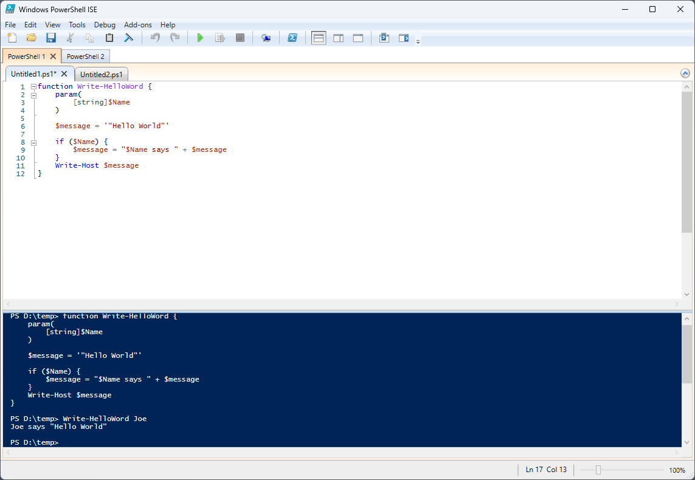
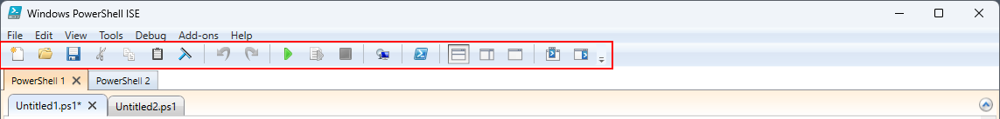
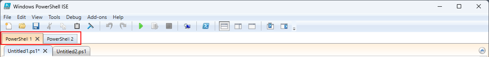
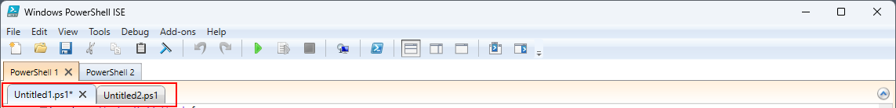
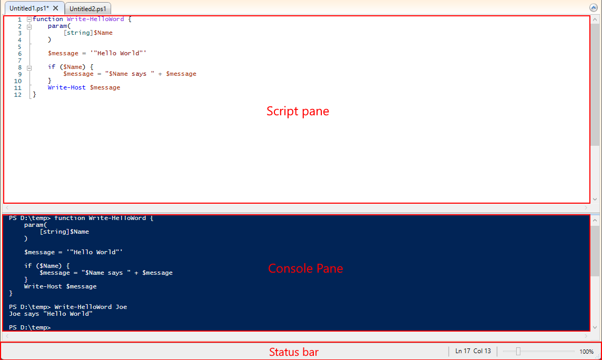

# Exploring the Windows PowerShell ISE

You can use the Windows PowerShell Integrated Scripting Environment (ISE) to create, run, and debug
commands and scripts.

The Windows PowerShell ISE consists of the menu bar, Windows PowerShell tabs,
the toolbar, script tabs, a Script Pane, a Console Pane, a status bar, a text-size slider and
context-sensitive Help.

## Menu Bar

The menu bar contains the **File**, **Edit**, **View**, **Tools**, **Debug**, **Add-ons**, and
**Help** menus.

The buttons on the menus allow you to perform tasks related to writing and running scripts and
running commands in the Windows PowerShell ISE. Additionally, an [add-on tool][11] may be placed on
the menu bar by running scripts that use the [The ISE Object Model Hierarchy][10].

## Toolbar

The following buttons are located on the toolbar.

|             Button             |                                                                                     Function                                                                                     |
| ------------------------------ | -------------------------------------------------------------------------------------------------------------------------------------------------------------------------------- |
| **New**                        | Opens a new script.                                                                                                                                                              |
| **Open**                       | Opens an existing script or file.                                                                                                                                                |
| **Save**                       | Saves a script or file.                                                                                                                                                          |
| **Cut**                        | Cuts the selected text and copies it to the clipboard.                                                                                                                           |
| **Copy**                       | Copies the selected text to the clipboard.                                                                                                                                       |
| **Paste**                      | Pastes the contents of the clipboard at the cursor location.                                                                                                                     |
| **Clear Console Pane**         | Clears all content in the Console Pane.                                                                                                                                          |
| **Undo**                       | Reverses the action that was just performed.                                                                                                                                     |
| **Redo**                       | Performs the action that was just undone.                                                                                                                                        |
| **Run Script**                 | Runs a script.                                                                                                                                                                   |
| **Run Selection**              | Runs a selected portion of a script.                                                                                                                                             |
| **Stop Operation**             | Stops a script that's running.                                                                                                                                                   |
| **New Remote PowerShell Tab**  | Creates a new PowerShell Tab that establishes a session on a remote computer. A dialog box appears and prompts you to enter details required to establish the remote connection. |
| **Start PowerShell.exe**       | Opens a PowerShell Console.                                                                                                                                                      |
| **Show Script Pane Top**       | Moves the Script Pane to the top in the display.                                                                                                                                 |
| **Show Script Pane Right**     | Moves the Script Pane to the right in the display.                                                                                                                               |
| **Show Script Pane Maximized** | Maximizes the Script Pane.                                                                                                                                                       |
| **Show Command Window**        | Shows the Commands Pane for installed Modules, as a separate Window.                                                                                                             |
| **Show Command Add-on**        | Shows the Commands Pane for installed Modules, as a sidebar Add-on.                                                                                                              |

## Windows PowerShell Tabs

A Windows PowerShell tab is the environment in which a Windows PowerShell script runs. You can open
new Windows PowerShell tabs in the Windows PowerShell ISE to create separate environments on your
local computer or on remote computers. You may have a maximum of eight PowerShell tabs
simultaneously open.

For more information, see [How to Create a PowerShell Tab in Windows PowerShell ISE][02].

## Script Tab

Displays the name of the script you are editing. You can click a script tab to select the script you
want to edit.

When you point to the script tab, the fully qualified path to the script file appears in a tooltip.

## Script Pane

Allows you to create and run scripts. You can open, edit and run existing scripts in the Script
Pane. For more information, see [How to Write and Run Scripts in the Windows PowerShell ISE][07].

## Console Pane

Displays the results of the commands and scripts you have run. You can run commands in the Console
pane. You can also copy and clear the contents in the Console Pane.

For more information, see the following articles:

- [How to Use the Console Pane in the Windows PowerShell ISE][06]
- [How to Debug Scripts in Windows PowerShell ISE][03]
- [How to Use Tab Completion in the Script Pane and Console Pane][05]

## Status Bar

Allows you to see whether the commands and scripts that you run are complete. The status bar is at
the bottom of the window. Selected portions of error messages are displayed on the status bar.

## Text-Size Slider

Increases or decreases the size of the text on the screen.

## Help

Help for Windows PowerShell ISE is available on Microsoft Learn. You can open the Help by clicking
**Windows PowerShell ISE Help** on the **Help** menu or by pressing the <kbd>F1</kbd> key anywhere
except when the cursor is on a cmdlet name in either the Script Pane or the Console Pane. From the
**Help** menu you can also run the `Update-Help` cmdlet, and display the Command Window which
assists you in constructing commands by showing you all the parameters for a cmdlet and enabling you
to fill in the parameters in an easy-to-use form.

## See Also

- [Introducing the Windows PowerShell ISE][08]
- [How to Use Profiles in Windows PowerShell ISE][04]
- [Accessibility in Windows PowerShell ISE][01]
- [Keyboard Shortcuts for the Windows PowerShell ISE][09]

<!-- link references -->
[01]: Accessibility-in-Windows-PowerShell-ISE.md
[02]: How-to-Create-a-PowerShell-Tab-in-Windows-PowerShell-ISE.md
[03]: How-to-Debug-Scripts-in-Windows-PowerShell-ISE.md
[04]: How-to-Use-Profiles-in-Windows-PowerShell-ISE.md
[05]: How-to-Use-Tab-Completion-in-the-Script-Pane-and-Console-Pane.md
[06]: How-to-Use-the-Console-Pane-in-the-Windows-PowerShell-ISE.md
[07]: How-to-Write-and-Run-Scripts-in-the-Windows-PowerShell-ISE.md
[08]: Introducing-the-Windows-PowerShell-ISE.md
[09]: Keyboard-Shortcuts-for-the-Windows-PowerShell-ISE.md
[10]: object-model/The-ISE-Object-Model-Hierarchy.md
[11]: object-model/The-ISEAddOnTool-Object.md
