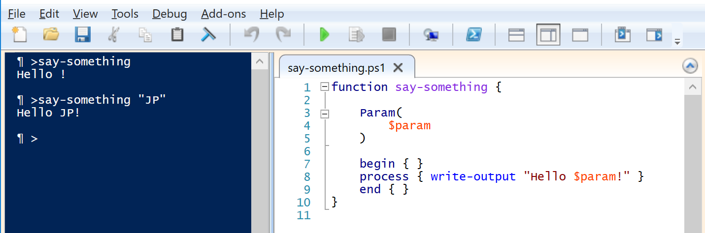
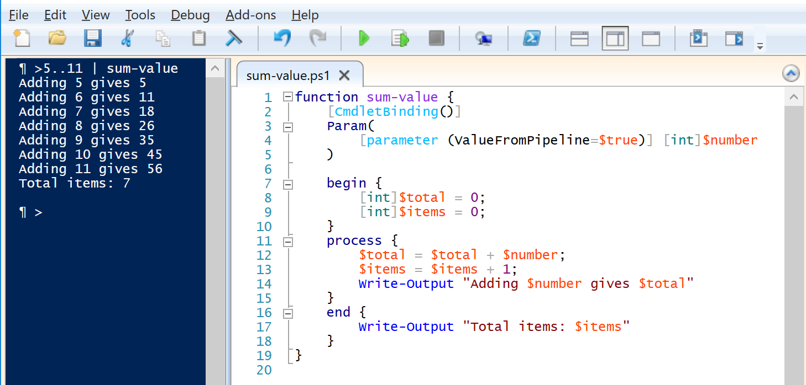
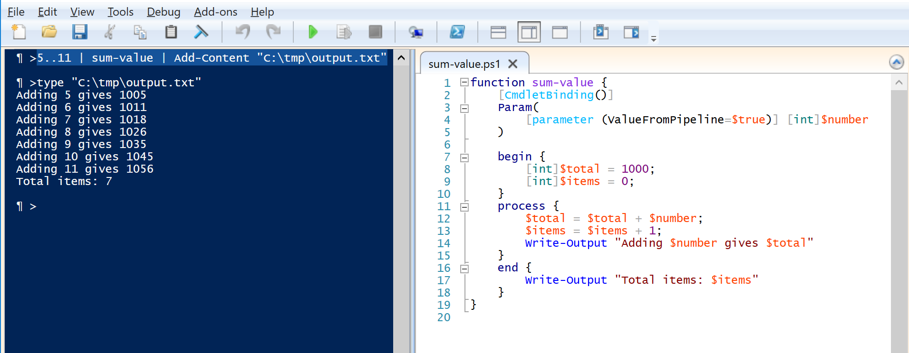

# Introduction

PowerShell is a scripting language based in commands. As a language it is
oriented to give orders to a computer; so, the structure of the language is
action -_verb_- first and subject -_noun_- last; ie. `Get-Process` commands the
computer to give you the information about all processes. As in all languages,
you also have the option to further qualify your command; like specifying which
processes are you interested in, ie. `Get-Process -Id 0` commands the computer
to return the information for the process with Id 0.

PowerShell is defined as a scripting language because you can write down the
commands in a file and then you can pass the file to PowerShell to execute those
commands. Also, you can open PowerShell and start writing commands and see how
they get executed.

Shell languages are scripting languages that allow to connect two or more
commands in a chain, where the results of one command are the input to the next
command, and so on. One can also say that PowerShell is a shell scripting
language because it allows to connect the results from one execution into the
next execution; as in `Get-Process | Where-Object { $_.Name -like "*host*"}` that
filters the results of the `Get-Process` to retrieve only those processes with
names that have 'host' anywhere in the name. As you can imagine, 'Get-Process'
and 'Where-Object' are two different commands; and, 'Where-Object' is taking
it's input from the results of the previous command.

As mentioned before, PowerShell language is made of instructions in the form of
'*verb-noun*'; you'll find in all literature about PowerShell that these
instructions are defined as ***cmdlets***. Having a unique word to identify
PowerShell instructions, from instructions in other languages, makes searching
for them easier as only the expected results will come back to you.

Having said that PowerShell is a shell scripting language because you can write
files of commands that you later can reuse or that you can connect commands and
form chains of them is a fair statement; but, it doesn't tell why is PowerShell
the best scripting language for computers under the Windows operating system.

What makes PowerShell one of the best shells to work with is the fact that
PowerShell uses objects instead of text when passing the results of one command
to the next. This ability of working with objects gives an incredible power to
PowerShell; now you have access to all the properties, of one instance of the
object, at the same time you're processing one result from the previous
command. In other shells what you have is text flowing between commands and you
guess (it might be an educated guess, but guessing it is) what is each piece of
data you process.

Before going any further let's summarize what we have up to here; PowerShell is:
* A scripting language because it allows you to write commands to a file for
later execution.
* A shell scripting language because it allows to connect commands in a
chain of results-input.
* A language meant to command a computer and for this all instructions are
given in an action-subject style; **all instructions in PowerShell** have the
form of **verb-noun**.
* An object based scripting language.

# Getting Inside PowerShell Cmdlets
Sometimes to get a better understand of something, one needs to crack it open up
to see what's inside and to figure out how it works. So, let's get inside of a
cmdlet and see: what's it made of and how are the pieces laid out.

> Note  
> Open your PowerShell ISE environment to better follow the rest of this section.
>If you don't remember how to open ISE, check the [learners setup guide](basic-setup.md)

>Note  
>We're about to open a cmdlet; but, worry not if you don't understand everything
>you're seeing in here; you'll be guided to look into the relevant parts first
>and helped to make all connections.  

In the end you should have a full conceptual understanding of what is a cmdlet,
how is that objects are handled and something new called pipeline.

## *do-nothing*: the internals of a cmdlet

```powershell                    
function do-nothing {  

    begin { }         
    process { }       
    end { }           
}                     
```                   

Write the above sample in ISE; then, either press the green 'run script' button
or press the **F5** key; finally, in the 'Console' window type `do-nothing` and
press **Enter**. You should have something similar to the next image:


Nothing had happened, as expected from a 'do-nothing' instruction or command.

>Note  
>To have a similar view to the above picture, in the *View* menu select
*Show Script Pane Right*.
>
> Also, to clear the Console use the `CLS` command to have a similar result as
> shown in the images here.

Let's start reviewing what we have here:
* A cmdlet is a function !!  
This is true whether the cmdlet was created through compiled code or created as
a PowerShell scripted function.
* All cmdlets are executed in three (3) steps: **begin**, **process**, **end**;
in that order.

Let's modify the `do-nothing` into something that greets; like a 'say-hello'
kind of function:

## *say-hello*: *process* in action

```powershell                    
function say-hello {

    begin { }
    process { write-output "Hello !"}
    end { }
}                    
```    

Again, after writing the code in the ISE remember to execute the script before
using the cmdlet; if you don't execute the script before, you'll get an error
message similar to this:


If `say-hello` is successfully executed, the console pane should look like the
following image.


In a few words, since `begin` and `end` are empty they bring nothing to this
execution. Now, `process` only has one command with an obvious behavior: write
to the output (wherever output is located; in this case is the same console
where the command is executed). Nothing very surprising.

Let's crack open another cmdlet to see how input can be taken in account.

## *say-something*: taking input

```                    
function say-something {

    Param(
        $param
    )

    begin { }
    process { write-output "Hello $param!" }
    end { }
}               
```   

The first thing to do here is to execute the script and then, at the Console
pane, execute the cmdlet: `say-something` with no input. Then we execute the
cmdlet with input: `say-something "JP"`. The results are shown in the next image.



Clearly, there is a way to communicate with cmdlets and that is via parameters.
Good to know, parameters can be used in any of the three execution parts of the
cmdlet; you just mention the parameter wherever you need it. In this case it
was only used in the *process* section.

Before the next cmdlet is dissected; a neat trick needs to be presented, to be
able to maintain focus on the cmdlet later.

In the Console pane of the ISE type the following line: `5..11`and press
**Enter**. You should have something similar to the next image.


A full sequence of numbers has been generated, starting at 5 and finishing in 11
(as was expected, somehow). Note that every element in the sequence is generated
in it's own line; this means every element is a different object (we will come
to this in a minute).

Now, that the wow is subsiding, we'll dissect the next cmdlet.

## *greet-everything*: using results as input

```                    
function greet-everything {
    [CmdletBinding()]
    Param(
        [parameter (mandatory=$true, valuefrompipeline=$true)] [string]$name
    )

    begin{ }
    process { Write-Output "Hello $name" }
    end{}
}               
```                   

>**Note**  
>Remember to execute the script before attempting to run the command in the
>Console pane.

If we pass the results of range operator `..` to the newly created
`greet-everything` as in the following line: `5..11 | greet-everything`

You should see results similar to the next image.


Please notice how the results from the range operator, `5..11`, are
being processed and mixed with the '*Hello* ' greet in `greet-everything`.   

This now requires some illustration to understand what's really happening here.

Let's take a closer look at some relevant points:
* A parameter was defined here that states that wants to use whatever is in the
*pipeline* (this we'll be explained shortly).
* The *process* section seems to be executed once for each number coming from
the range command.  

## Tying everything up together, full cmdlet explained

Now that the *greet-everything* cmdlet is crack-opened in the dissection table,
let's try some tweaking to see if we can get a better understanding of all the
parts.

If *begin* is a function that's executed at the beginning and it's only executed
once, we could add two counters: (a) one to count the number of times the
*process* section is invoked and (b) one to sum the numbers received from the
previous command. To be sure this section is executed at the beginning and only
once, let's set the value of the sum accumulator to 1,000; this way it will be
easy to follow the initialization and the running sum.

Similarly, if *end* is, also, a function that's executed at the end and it's
only executed once; we could use the *end* section to show some results after
everything has been greeted, well more like, processed.

Last, but not least, let's rename the cmdlet to something more accurate, like
*sum-value*; and, make sure we're receiving the right input from the previous
cmdlet by making the input parameter of type *int*. Don't panic if you feel you
don't know the syntax or all the details of it; the whole idea is to get a
conceptual on how PowerShell works from the inside out, not to stop and analyze
every bit of the code (there are other sections in this
[Getting Started with PowerShell](Getting-Started-with-Windows-PowerShell.md))
guide that will take care of the details of the syntax).

Now, let's look at the tweaked code and this explanation will continue
afterwards.

```
function sum-value {
    [CmdletBinding()]
    Param(
        [parameter (ValueFromPipeline=$true)] [int]$number
    )

    begin {
        [int]$total = 1000;
        [int]$items = 0;
    }
    process {
        $total = $total + $number;
        $items = $items + 1;
        Write-Output "Adding $number gives $total"
    }
    end {
        Write-Output "Total items: $items"
    }
}
```

By looking at the *Param* section you can see that we are expecting integers as
input to this cmdlet; at the same time, you can also tell that received input is
called *$number*.

As mentioned before, in the *begin* section we added two variables to hold the
sum of the numbers and the count of items sent from the previous cmdlet.

Now, looking at the *process* section you can see that we're adding *$number*
with *$total* and saving the result in *$total*; another way to say this, is
to say that we have incremented *$total* by *$number*.  
Next, we incremented *$items* by 1.  
To close the *process* section, a message is written to show progress.

Finally, in the *end* section we finish with a written message of how many items
were received.

Let's look at the execution.



The execution confirms what we guessed about the behavior of the cmdlet.

The *begin* section was executed only one time, before any *process*; as the
first run of the *process* shows the result of adding '*5*' gives '*1005*',
which could only be true if *$total* was initialized to 1,000.

Next, all subsequent invocations of *process* do not trigger the execution of
*begin* because the running sum is a continuation of the previous value shown.

Finally, the *end* section was invoked after all items from the range cmdlet
were processed.

So far, we have seen the anatomy of every cmdlet in PowerShell; regardless of
how it was created, either compiled code or advanced function script. We have
seen that cmdlets are command oriented instructions, that can take input from
the script (in the form of parameters) or from the results of the execution of
a previous cmdlet. Every cmdlet is a small program (function) tailored to execute
a specific task; usually the name of the cmdlet '*verb-noun*' expresses the
action and the subject upon which the action is taken, as in Get-Process.

In scripting shell languages, the name of the place where results are placed for
the next command to take them is ***pipeline***. This comes from the visualization
of data being funneled from one command to the next through a plumbers pipe. The
pipeline (as an object in shell scripting languages) is represented by the
vertical bar symbol '**|**'. So, when we wrote `5..11 | sum-value`, we have
explicitly connected the 'range' command to the 'sum-value' cmdlet through the
pipeline.

In PowerShell writing to the output is placing data in the pipeline. It is the
responsibility of each cmdlet to put data in the pipeline; this can be
done in any of the three (3) parts of the cmdlet (*begin*, *process*, *end*).

Let's think a little bit about the last statement: "writing to the output is
placing data in the pipeline". This means that our created cmdlet 'sum-value',
that is taking input from the pipeline, by just writing to the output is placing
data in the pipeline for another command !? Is this right?

Let's see it!!  
If we write the following instructions in the *Console* pane and press **Enter**  
>`5..11 | sum-value | Add-Content "C:\tmp\output.txt"`  

We should be able to add content to the file 'output.txt' (in the 'C:\\tmp'
folder) by appending everything it was written by *sum-value*.



As shown in the image, the execution of the Add-Content cmdlet returns no
results; this is because the content taken from the pipeline is sent to the file,
nothing is sent to the pipeline. We had to restore to the "*type*" command to
verify the contents is in the file.   

# To summarize what was covered here

* PowerShell is a scripting language because it allows you to write commands to
a file for later execution.
* PowerShell is a shell scripting language because it allows to connect commands
in a chain of results-input.
* PowerShell is a language to command a computer. And, for this purpose, all
instructions are given in an action-subject format; this means that **all
instructions in PowerShell** follow the standard form of **verb-noun**.
* All PowerShell cmdlets are functions made of three sections: *begin*,
*process*, *end*. The *process* section is executed once for each item in the
*pipeline*.
* In PowerShell everything written to the output is placed in the *pipeline* for
the next cmdlet to pick it up.
