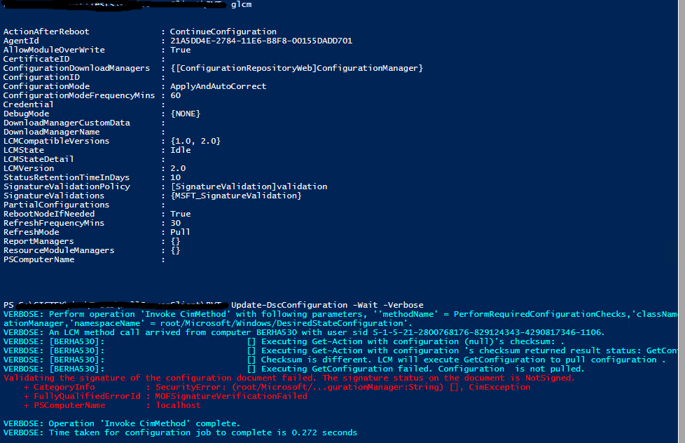
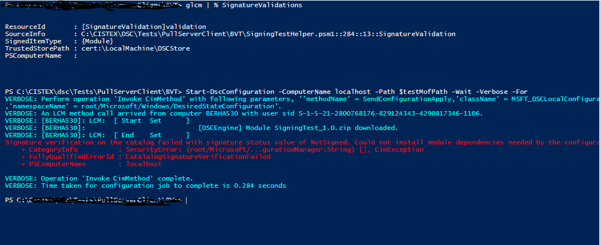
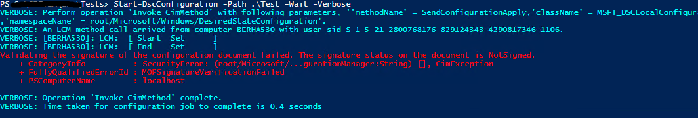
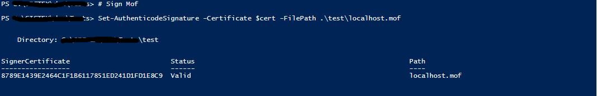
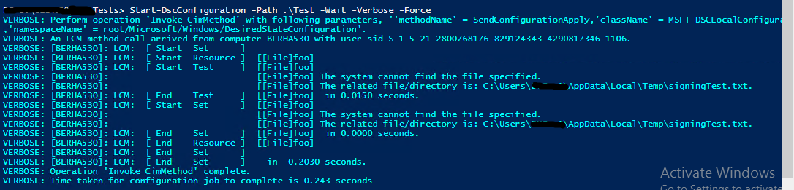

##DSC Module and Configuration Signing validations
In DSC, configuration documents and modules are distributed to managed machines from the pull server or pull server (in the case of Azure Automation pull service). If the pull server/service is compromised, an attacker can potentially modify the configurations and modules on the pull server and have it distributed to all managed machines, thus compromising even more machines of the customer. 

 This threat is addressed in WMF 5.1. DSC supports validating the digital signatures on modules and configuration (.MOF) files. This feature will prevent nodes from executing a configuration or module files that are not signed by trusted signer or that have been tampered with after they have been signed by trusted signer. 


###How to sign configuration and module 
***
1. Configuration Files (.MOFS):- 
The existing PowerShell cmdlet [Set-AuthenticodeSignature](https://technet.microsoft.com/library/hh849819.aspx) is extended to support signing of MOF files.  
2. Modules:-
Signing of modules is done by signing the corresponding module catalog using the following steps:- 
    * Create a catalog file: A catalog file contains a collection of cryptographic hashes, or thumbprints. Each thumbprint corresponds to a file that is included in the module.  A new cmdlet [New-FileCatalog](https://technet.microsoft.com/library/cc732148.aspx),
has been added to enable users create a catalog file for their module. Please refer to the catalog cmdlets [a relative link](catalog-cmdlets.md) to create catalog files. 
    * Sign the catalog file: 
using [Set-AuthenticodeSignature](https://technet.microsoft.com/library/hh849819.aspx) sign the catalog file.
    * Place the catalog file inside the module folder.
By convention, Module catalog file should be placed under the module folder with the same name as the module.

###LocalConfigurationManager Settings to enable signing validations.

####PULL
The LocalConfigurationManager of a node performs signing validation of modules and configurations based on its current settings. 
By default, signature validation is disabled. Signature validation can enabled by adding ‘SignatureValidation’ block to the meta-configuration definition of the node as shown below:-

```PowerShell
[DSCLocalConfigurationManager()]
Configuration EnableSignatureValidation
{
    Settings
    {
        RefreshMode = 'PULL'        
    } 
    
    ConfigurationRepositoryWeb pullserver{
      ConfigurationNames = 'sql'
      ServerURL = 'http://localhost:8080/PSDSCPullServer/PSDSCPullServer.svc'
      AllowUnsecureConnection = $true
      RegistrationKey = 'd6750ff1-d8dd-49f7-8caf-7471ea9793fc' # Replace this with correct registration key.
    }
    SignatureValidation validations{
        # By default,LCM will use default Windows trusted publisher store to validate the certificate chain. If TrustedStorePath property is specified, LCM will use this custom store for retrieving the trusted publishers to validate the content.
        TrustedStorePath = 'Cert:\LocalMachine\DSCStore'            
        SignedItemType =  'Configuration','Module'         # Those are list of DSC artifacts, for which LCM need to verify their digital signature before executing them on the node.       
    }
 
}
EnableSignatureValidation
Set-DscLocalConfigurationManager -Path .\EnableSignatureValidation -Verbose 
 ```

Setting the above metaconfiguration on a node enables signature validation on downloaded configurations and modules. 
The localconfigurationmanager will perform the following steps to verify the digital signatures.
* Verify the signature on a configuration file (.MOF) is valid. It uses the powershell cmdlet [Get-AuthenticodeSignature](https://technet.microsoft.com/library/hh849805.aspx), which is extended in 5.1 to support MOF sigature validation.
* Verify the certificate authority that authorized the signer is trusted.
* Download module/resource dependencies of the configuration to a temp location.
* Verify the signature of the catalog included inside the module.
    * Find a <moduleName>.cat file and verify its signature using the cmdlet  [Get-AuthenticodeSignature](https://technet.microsoft.com/library/hh849805.aspx).
    * Verify the certification authority that authenticated the signer is trusted.
    * Verify the content of the modules has not been tampered using the new cmdlet [Test-FileCatalog](https://technet.microsoft.com/library/cc732148.aspx).
* Install-module to $env:ProgramFiles\WindowsPowerShell\Modules\
* Process configuration.

Note: - Signature validation on module-catalog and configuration is only performed when the configuration is applied to the system for the first time or when the module is downloaded and installed. Consistency run does not validate signature of Current.mof or its module dependencies.
If verification has failed at any stage, for instance if the configuration pulled from the pullserver is unsigned, then processing of the configuration will be terminated with the error shown below and all temporary files will be deleted.



Similarily, Pulling a module whose catalog is not signed will result in the following error:-



####PUSH
A configuration delivered via push might be tampered at its source before it is delivered to the node. The Local configuration manager will perform similar signature validation steps for pushed or published configuration(s).
Below is a complete example of signature validation for push.

* Enable signature validation on the node.

```Powershell
[DSCLocalConfigurationManager()]
Configuration EnableSignatureValidation
{
    Settings
    {
        RefreshMode = 'PUSH'        
    } 
    SignatureValidation validations{
        TrustedStorePath = 'Cert:\LocalMachine\DSCStore'   
        SignedItemType =  'Configuration','Module'             
    }

}
EnableSignatureValidation
Set-DscLocalConfigurationManager -Path .\EnableSignatureValidation -Verbose
``` 
* Create a sample configuration file.

```Powershell
# Sample configuration
Configuration Test{

    File foo
    {
        DestinationPath =  "$env:TEMP\signingTest.txt"
        Contents = "ABC"
    }
}
Test
```

* Try pushing the unsigned configuration file in to the node. 

```Powershell
Start-DscConfiguration -Path .\Test -Wait -Verbose -Force
``` 


* Sign the configurtion file using code-signing cert.



* Try pushing the signed mof file.



