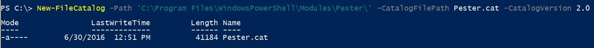
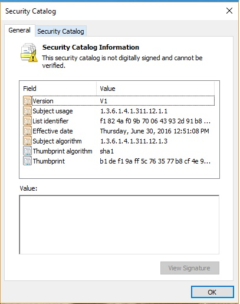
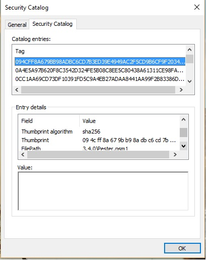
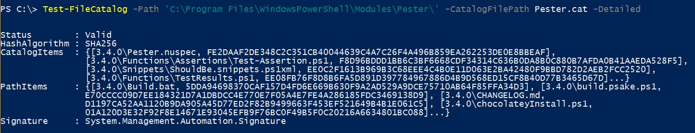


---
title: Catalog Cmdlets
author:  jaimeo
contributor: ?
---
# Catalog Cmdlets  

We have added two new cmdlets in [Microsoft.Powershell.Secuity](https://technet.microsoft.com/en-us/library/hh847877.aspx) module to generate and validate windows catalog files.  

New-FileCatalog 
--------------------------------

New File catalog creates a windows catalog file for set of folders and files. Catalog file contains hashes for all files in specified paths. User can distribute the set of folders along with corresponding catalog file representing those folders. It can be used by receiver of content to validate if any changes are made to the folders since catalog creation time.    

```PowerShell
New-FileCatalog [-CatalogFilePath] <string> [[-Path] <string[]>] [-CatalogVersion <int>] [-WhatIf] [-Confirm] [<CommonParameters>]
```
We support creating catalog version 1 and 2. Version 1 uses SHA1 hashing algorithm to create file hashes and version 2 uses SHA256. Catalog version 2 is not supported on *Windows Server 2008 R2* and *Windows 7*. It is recommended to use catalog version 2 if using platforms *Windows 8*, *Windows Server 2012* and above.  

To use this command on an existing module, specify the CatalogFilePath and Path variables to match the location of the module manifest. In the example below, the module manifest is in C:\Program Files\Windows PowerShell\Modules\Pester. 



This creates the catalog file. 

  

 

To verify the integrity of catalog file (Pester.cat in above exmaple) it should be signed using [Set-AuthenticodeSignature](https://technet.microsoft.com/library/hh849819.aspx) cmdlet.   


Test-FileCatalog 
--------------------------------

Test File catalog validates the catalog representing a set of folders. 

```PowerShell
Test-FileCatalog [-CatalogFilePath] <string> [[-Path] <string[]>] [-Detailed] [-FilesToSkip <string[]>] [-WhatIf] [-Confirm] [<CommonParameters>]
```



This cmdlet compares all the files hashes and their relative paths found in *catalog* with ones on *disk*. If it detects any mismatch between file hashes and paths it gives status as *ValidationFailed*. User can retrieve all this information using *-Detailed* flag. It also displays signing status of catalog in *Signature* filed which is same as calling [Get-AuthenticodeSignature](https://technet.microsoft.com/en-us/library/hh849805.aspx) cmdlet on catalog file. 
User can also skip any file during validation by using *-FilesToSkip* parameter. 

