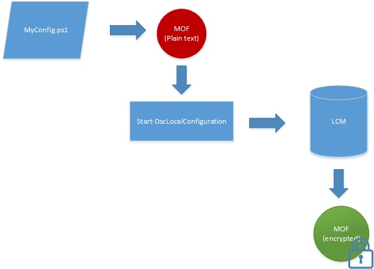

# MOF Documents Are Encrypted By Default

Configuration documents contain sensitive information. In previous versions of DSC you were required to distribute and manage certificates in order to secure credentials within a configuration. For many this was a significant management burden and even with all of the work it took to do this you were still left with some configuration information that was not and could not be secured. 

That is no longer the case because **all configuration MOFs are secured by default**. No certificates or meta-configuraiton settings are needed. Any time a configuraiton MOF is saved to disk by the Local Configuration Manager (LCM) on a target node, it is encrypted. The MOFs are encrypted using [DPAPI](https://msdn.microsoft.com/en-us/library/ms995355.aspx). **Note:** MOFs genenerated by a configuation script are not encrypted.

**Example:** Encryption in push mode

If you are already using the certificate method for encrypting passwords or if you need additional security for your passwords, the [existing method of certificate based encryption](http://blogs.msdn.com/b/powershell/archive/2014/01/31/want-to-secure-credentials-in-windows-powershell-desired-state-configuration.aspx) will continue to work. Thie result will be a MOF document that is fully encrypted using the DPAPIs and additionally have passwords encrypted wthin it.

This encryption only applies to configuraiton MOF documents (pending.mof, current.mof, previous.mof and partial MOFs). Meta-Configuration MOFs are still saved in plain text since they less likely to contain secrets. 
