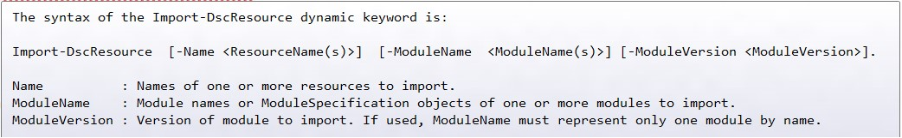

# Import-DscResource keyword supports -moduleversion parameter

We have added a new parameter to Import-DscResource dynamic keyword available when authoring DSC Configurations. This will help the authors directly specify the module version to load the DSC resources from. The new syntax of the keyword is:

In ISE it is shown IntelliSence.

Before this, the only way to specify the module version when loading DSC resources by using Module specification object e.g.: `–ModuleName @{ModuleName='UserConfigProvider';ModuleVersion='3.0'}`

This new parameter 'ModuleVersion' simplifies the experience of specificing a version for a module when authoring a configuration. The –ModuleVersion parameter can only be used in combination with the –ModuleName parameter. It cannot be used with resource names using –Name parameter only.
