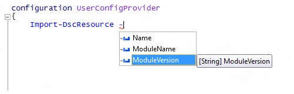

# Import-DscResource keyword supports -ModuleVersion parameter

We have added a new parameter to the `Import-DscResource` dynamic keyword available when authoring DSC configurations. Configuration authors can now specify exactly which module version to load the DSC resources from. The new syntax of the keyword is:

```powershell
Import-DscResource [-Name <ResourceName(s)>] [-ModuleName <ModuleName(s)>] [-ModuleVersion <ModuleVersion>]
```

* **Name**: Names of one or more reosurces to import.
* **ModuleName**: Module names or ModuleSpecification objects of one or more modules to import.
* **ModuleVersion**: Version of module ot import. If used, ModuleName must represent only one module by name. 

In the Windows PowerShell ISE, it shows up with IntelliSense:



**Note**: the `–ModuleVersion` parameter can only be used in combination with the `–ModuleName` parameter. It cannot be used with resource names using only the `–Name` parameter.

Before this, the only way to specify the module version when loading DSC resources was by using the Module specification object e.g.: `–ModuleName @{ModuleName="UserConfigProvider";ModuleVersion="3.0"}`

