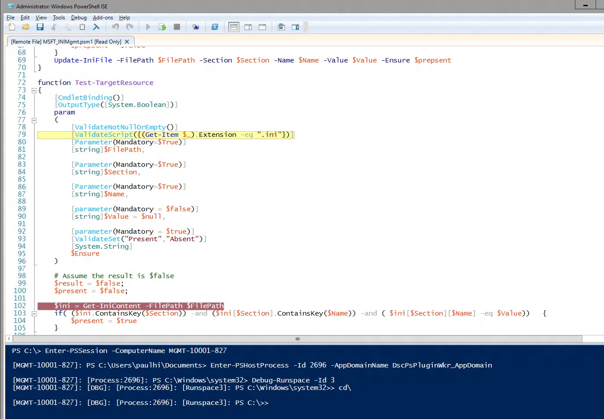

# DSC Resource Script Debugging
WMF 5.0 Production Preview includes support for debugging DSC resource scripts while they run on target nodes. In older WMF 5.0 releases, we added advanced script debugging features with the ability to attach to local processes (Get-PSHostProcessInfo, Enter-PSHostProcessInfo, Exit-PSHostProcessInfo), enumerate all runspaces in a process, and debug an arbitrary runspace in a process (Get-Runspace, Debug-Runspace).

DSC resource script debugging builds on this work by adding two new cmdlets.

##Syntax
**Enable-DscDebug**
Enable-DscDebug \[-BreakAll\] \[-CimSession &lt;CimSession\[\]&gt;\] \[-ThrottleLimit &lt;int&gt;\] \[-AsJob\] \[-WhatIf\] \[-Confirm\] \[&lt;CommonParameters&gt;\]

**Disable-DscDebug**
Disable-DscDebug \[-CimSession &lt;CimSession\[\]&gt;\] \[-ThrottleLimit &lt;int&gt;\] \[-AsJob\] \[-WhatIf\] \[-Confirm\] \[&lt;CommonParameters&gt;\]

##Typical WorkFlow


```PowerShell
PS C:\Test> Enable-DscDebug –BreakAll

PS C:\Test> Start-DscConfiguration -path .\TestConfig2 -Wait -Verbose
VERBOSE: Perform operation 'Invoke CimMethod' with following parameters, ''namespaceName' = root/Microsoft/Windows/DesiredStateConfiguration,'className' = MSFT\_DSCLocalConfigurationManager,'methodName' = SendConfigurationApply'.
VERBOSE: An LCM method call arrived from computer MGMT-10001-827 with user sid S-1-5-21-397955417-626881126-188441444-3860663.
VERBOSE: [MGMT-10001-827]: LCM: [ Start Set ]
WARNING: [MGMT-10001-827]: [DSCEngine] Warning LCM is in Debug 'ResourceScriptBreakAll' mode. Resource script processing will be stopped to wait for PowerShell script debugger to attach.
VERBOSE: [MGMT-10001-827]: [DSCEngine] Importing the module C:\WINDOWS\system32\WindowsPowerShell\v1.0\Modules\PSDesiredStateConfiguration\DscResources\MSFT_EnvironmentResource\MSFT_EnvironmentResource.psm1 in force mode.
VERBOSE: [MGMT-10001-827]: LCM: [ Start Resource ] [[Environment]e1]
VERBOSE: [MGMT-10001-827]: LCM: [ Start Test ] [[Environment]e1]
VERBOSE: [MGMT-10001-827]: [[Environment]e1] Importing the module MSFT_EnvironmentResource in force mode.
WARNING: [MGMT-10001-827]: [[Environment]e1] Resource is waiting for PowerShell script debugger to attach. Use the following commands to begin debugging this resource script:
Enter-PSSession -ComputerName MGMT-10001-827 -Credential <credentials>
Enter-PSHostProcess -Id 2640 -AppDomainName DscPsPluginWkr_AppDomain
Debug-Runspace -Id 3

PS C:\Test> Disable-DscDebug
```
Now lets take a look at each of these commands and what they do:

**Enable-DscDebug –BreakAll**
Enable-DscDebug cmdlet with BreakAll configures the DSC LCM to run Get-TargetResource, Set-TargetResource, and Test-TargetResource scripts in Break All mode. This means that the script stops at the first script statement and waits for a debugger to be attached. You can then connect to the target computer by using Windows PowerShell remoting, and attach the Windows PowerShell debugger to the LCM process and runspace to debug the script. After you do this, you can set breakpoints and debug the script in the normal Windows PowerShell way.

**Start-DscConfiguration -path .\TestConfig2 -Wait -Verbose**

This kicks off DSC but as noted above, since the target node has debug mode enabled it will stop at the first DSC resource that the LCM executes.

In order to begin the debugging session run the commands shown in the warning message after running Start-DscConfiguration, you attach your client Windows PowerShell script debugger to the appropriate computer, process, application domain, and runspace.

* Run this command to optionally use Windows PowerShell remoting to connect to the target computer. Skip this if you already have a remote desktop connection.
```PowerShell
Enter-PSSession -ComputerName MGMT-10001-827
```
* This command attaches to the DSC LCM host process and app domain where the resource script is running.
```PowerShell
Enter-PSHostProcess -Id 2640 -AppDomainName DscPsPluginWkr\_AppDomain
```
*  This last command lets you debug the DSC runspace running the script.
```PowerShell
Debug-Runspace -Id 3
```


After you have the debugger attached, set line breakpoints where you want to investigate script execution and run the **continue** debugger command to let the script run in the debugger. When you are done debugging, you can stop the script from running by typing the **quit** debugger command, or let the script continue to run without the debugger by running the **detach** debugger command.

Notice that ***all*** resource scripts are stopped in the debugger. This means that Test-TargetResoruce, Set-TargetResource, and Get-TargetResource scripts each in turn stop in the debugger. If you don't want to debug a resource script, you can exit debug mode in the runspace by running this command.

Disable-RunspaceDebug -RunspaceId 3

Or you can attach the debugger by running Debug-Runspace, and then immediately run the **detach** command.

After you are done debugging your resource script, you should stop the DSC configuration by running the following command.

Stop-DscConfiguration –Force

Finally, you must reconfigure the target computer LCM to disable debug mode using Disable-DscDebug cmdlet..